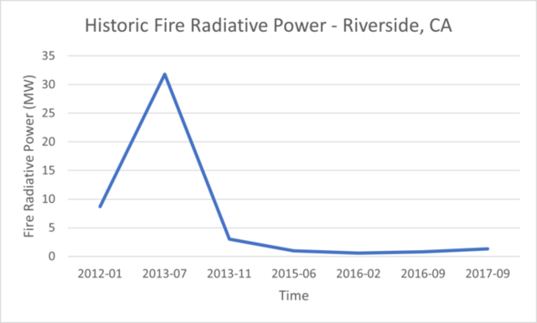
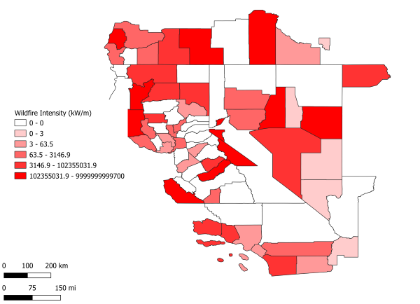

# Data Scientist
- UC Riverside, Master of Science in Engineering - Data Science (expected completion Spring 2023)
- Cal Poly Pomona, Bachelor of Science - Chemistry

# About Me
I am from Orange, California, where the orange groves used to dominate the city. During my undergraduate carrer, I worked in a lab doing benchtop work testing electroplating solutions to ensure efficent electroplating for our aerospace and electronics customers. My first job after geting by BS, I worked at Beckman Coulter Inc. for 9 months as a Quality Assurance Technichan handling equipment shipping logistics for engineers globally. Through my experience at Beckamn Coulter, I decided to make a drastic change in my carrer towards being a Data Scientist. I am now at UC Riverside's graduate program in Data Science working to achevie my goal. My past experience in chemistry and medical diagnostics has provided me with a strong foundation of the analytical insight on data. Although my data science career is just beginning, I will continue to build my knowledge in data science. 

With life being fast-paced with instant results, I grew to enjoy gardening (punn intended). Gardening makes me appreciate patience and consistency when taking care of plants. Seeing the wonderful blooms of plumeria and snapdragon flowers to growing my own peppers and herbs. I am also an avid viewer of the MCU. My favorite Marvel character is Wanda Maximoff and she was just being reasonable.  

# Projects
## Wildfire Data Analysis
* For the completion of Intro to Big Data Management 
* I was tasked to do a temporal analysis of the wildfire data. I aided in the other tasks by helping troubleshoot errors my groupmates had. Other tasks were data preparation and Spatial Analysis.
* As a group, this project was coded in Scala and we used Spark API transform and clean data to be able to perform SQL queries on them.
* This project was completed in a week via Zoom.
### Temporal Analysis
  * Query wildfire data to obtain monthly total of fire intensities. Using Excel to visualize trends. 

### Data Preparation
The first task is to prepare the data for processing. This includes two major steps. First, introduce a new attribute County that indicates the county at which each wildfire happened. Second, convert the file into a column-oriented Parquet format to speed up the analysis.

* Parse and load the CSV file using the Dataframe API.
* Introduce a geometry attribute that represents the location of each wildfire. (ST_CreatePoint function)
* Dealing with multiple values in a single column. Convert fire radiative power that sometimes has 2 values stored and converted from float to double. 
* Use the attribute GEOID from the county to introduce a new attribute County in the wildfire. We couldn't use the county name because it is not unique across the 
* Output the wildfire data as a parquet file.

### Spatial Analysis
  * Query wildfire data to obtain fire intensities of counties of California. 
  * Equijoin wildfire data to counties data by the key-value counties shared by both datasets. 
  * Used QGIS to visualize the fire intensites of each county using Beast to convert logitudes and latitudes to geometry datatype.

## Stroke Prediction
* For the completion of Data Mining Techniques 
* As a group, we experimented with different classification methods to predict if a patient was at risk of having a stroke. 
### Preprocessing Data
We explored the patient dataset to search for features that have null/missing values. Using boxplots we can look at each feature to see if there are any outliers. We then encoded and normalized the features. During this phase, we also noticed how imbalanced the dataset was and used SMOTE to avoid oversampling the minority class.
### Random Foreset
- I was tasked to create a random forest algorithm. Random Forest is a ensemble method were many decision trees are created with randomized features.  
- Maximizing the information gain we pick the highest gain to split.
- To maximize information gain, we need a low entropy node, meaning there are more similar data points.
- 
 
### Additional Information
Other methods I was exposed to in this project were K-nearest neighbors, SVM, Naive Bayes, and Logistic Regression.
I was the lead on writing our report in a scientific format. Below is a link to view our work. 
[Download Stroke Prediction Scientific Report](https://github.com/johnny-pham23/portfolio/files/8916226/Stroke.Prediction.Final.Final.pdf)

# Relevant Coursework
- Intro to Big Data Management 
- Data Mining Techniques

